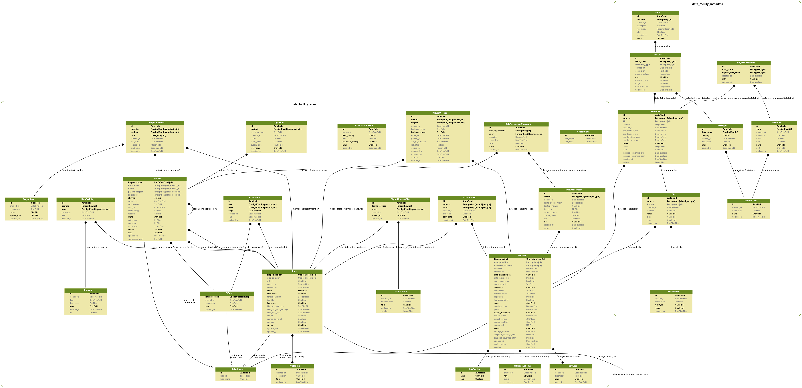

w# Data Facility Admin


[](https://www.codacy.com?utm_source=github.com&amp;utm_medium=referral&amp;utm_content=NYU-Chicago-data-facility/dfadmin&amp;utm_campaign=Badge_Grade)
[](https://www.codacy.com?utm_source=github.com&utm_medium=referral&utm_content=NYU-Chicago-data-facility/dfadmin&utm_campaign=Badge_Coverage)

Admin system for the Data Facility.

# Why

DFAdmin was created to organize the core entities of a Data Facility such as Datasets, People and Projects. It is used as a core component on ADRF, being the orchestrator of IAM. Read more on the [ADRF Framework, Data Model and DFAdmin whitepaper](https://coleridgeinitiative.org/assets/docs/adrf_framework_whitepaper.pdf).

### Features
* [Change Log](documentation/CHANGELOG.md)
* [Roadmap](documentation/ROADMAP.md)

### Data Model


### Screenshots


# Requirements

* Docker (v 17.12.0)& Docker Compose (https://www.digitalocean.com/community/tutorials/how-to-install-and-use-docker-compose-on-centos-7)
* Wait-for-it. After git clone, run `make git-submodules-init`

Teste on MacOX: Docker version 17.12.0-ce, build c97c6d6

# Deploy - with Docker

Two containers are used:
* **web**: to run the web application and Django management tasks.
* **db**: is a PostgreSQL database with a local folder mounted as the data volume.

Copy the code to the desired server and run:
1. `make deploy-build-latest`: used to build the containers on the first time and to update the web container when needed.
2. `make depoy-up`: used to run start the containers.

# Development

## Prepare the application and database
0. Run `ln -s local.env .env` to symlink the local dev configuration
1. Run the containers `docker-compose up -d`
2. Prepare the database with the data backup and migrate `make dev-db-restore` or just `make db-migrate` if you don't have a previous db backup to use.
3. Create the super user: `docker-compose exec web ./manage.py createsuperuser` (if you restored the dev db it might already have a super user with `dfadmin/dfadmin` credentials)
4. Run tests (`make test`) to make sure all is right.

Cheers! Go to `http://localhost:8000` and check the DF Admin website.

## Running tests
You can run tests with the following:
* `make test`: to run tests creating the database (necessary on the first run)

## Clean the database (Postgres)
This will wipe out everything (tables, sequences and views; the whole schema): `dev-db-clear`

## Access
Now access the `<host>:8000/admin` and you should be prompted for login credentials.

## Before commit
Before commit your changes, please:
1. Run tests: `make test`
2. Run code checks: `make code-check`


# LDAP Control
_(needs update)_

When you write users and groups in LDAP, we should know some information like objectClass, loginShell, HomeDirectory, uidNumber, and gidNumber.
All the groups that exist in LDAP should come from DF Admin. We should have the Django models Group, Dataset, and Project in DF Admin. These models should use the same sequence to set their id value, and we should use this id to set the gidNumber in LDAP. We should use the id of the Django model User as the uidNumber. The groups and users in LDAP should be created only by DF Admin. The rest of the necessary information necessary to create groups and users in LDAP should be processed by a script using conventions.

# Troubleshooting

**wait for it not found**: Make sure you initialized the submodules. (see requirements above)

# Documentation

Reference the folder `documentation`.

## UML Class Diagram
A class diagram can be generated automatically based on the models with [django_model_graph.sh](https://gist.github.com/perrygeo/5380196)
```bash
source env/bin/activate
make docs
```

## Release

Please check the [RELEASE documentation](documentation/RELEASE.md) when preparing a release.  
